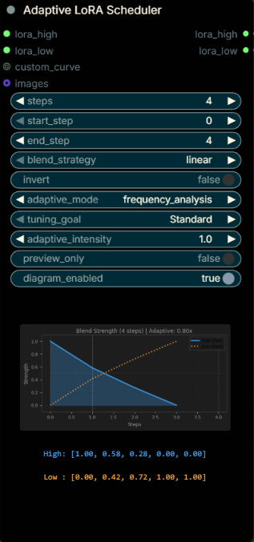

# Adaptive LoRA Scheduler for ComfyUI

**Smart LoRA Blending for Wan 2.2 I2V**


**I TRIED TO DO SOMETHING BENEFICIAL AND NEW, BUT IT TURNED OUT AS A FAILURE, MAYBE I DIDN'T TEST IT ENOUGH AND SOMEONE ELSE WILL FIND IT USEFUL**

**in the workflow provided the Speed Loras will be set at strength 1.0, and only LoRA's connected to Adaptive LoRA Scheduler will be blended Dynamically**


This node allows you to dynamically schedule and blend multiple LoRAs (High/Low) over the generation steps. It includes an **Adaptive Mode** that automatically adjusts the blend curve based on the complexity of your input image.

## ✨ Features
- **Dynamic Scheduling**: Choose from `Linear`, `Ease-In`, `Ease-Out`, `Sigmoid`, or custom curves.
- **Adaptive Mode**: Automatically analyzes your input (image or video) to adjust blending strength.
    - *High Complexity (Detail/Texture)* → Keeps LoRA strong longer (Convex curve).
    - *Low Complexity (Flat/Smooth)* → Fades LoRA faster (Concave curve).
- **Visual Preview**: See the exact blending curve in real-time on the node.

## 🖼️ Node Screenshot



**Adjust the number of the start-end step based on how many steps you have on Ksampler**
---

## 🚀 Quick Start Guide

### 1. Installation

#### Method A: Git Clone
1.  Open command line in `ComfyUI/custom_nodes/`
2.  Run:
    ```bash
    git clone https://github.com/depersonityhom/ComfyUI-Dynamic-Lora-Scheduler.git
    cd ComfyUI-Dynamic-Lora-Scheduler
    pip install -r requirements.txt ( it will install numpy>=1.20.0 and matplotlib>=3.3.0 make sure it doesn't conflict with your environment)
    ```
3.  Restart ComfyUI.

#### Method B: Manual (Zip)
1.  Download the ZIP file from this repo.
2.  Extract it into `ComfyUI/custom_nodes/`.
3.  Ensure the folder name is `ComfyUI-Dynamic-Lora-Scheduler`.
4.  Run `pip install -r requirements.txt`.
5.  Restart ComfyUI.

### 2. How to Use
1.  **Add Node**: Search for `Adaptive LoRA Scheduler`.
2.  **Connect LoRAs**:
    - `lora_high`: Connect your "End/Target" LoRA.
    - `lora_low`: Connect your "Start/Base" LoRA.
3.  **Connect Output**:
    - Connect the **`lora_high`** output to the **`WanVideoSetLoRAs`** node for your **High Model Chain**.
    - Connect the **`lora_low`** output to the **`WanVideoSetLoRAs`** node for your **Low Model Chain**.
    - **Using Multiple LoRAs (e.g., Speed LoRA)?**:
        - ComfyUI handles patches sequentially. **Chain** your nodes!
        - `Model Loader` → `WanVideoSetLoRAs` (Speed LoRA) → **`WanVideoSetLoRAs` (Adaptive Node)** → `KSampler`.
        - You need a *new* `WanVideoSetLoRAs` node just for the Adaptive Scheduler. Connect the previous model output to this new node's input.
4.  **Connect Image**:
    - Connect your source image (for I2V) or video frames to the **`image`** input to enable Adaptive Mode.

### 3. Parameters Explained

#### 🎛️ Blending Strategy
*Controls the base shape of the transition.*
- **Linear**: Constant speed. Best for general use.
- **Ease-In**: Starts slow, speeds up at the end.
- **Ease-Out**: Starts fast, slows down at the end.
- **Sigmoid**: Slow start → Fast middle → Slow end. Best for distinct phase separation.

#### 🧠 Adaptive Mode (Requires `image` input)
*Modulates the Blend Strategy based on image content using Frequency Analysis (FFT).*

1.  **Adaptive Mode**: Set to `frequency_analysis` (Recommended). This accurately detects if your image is textured (High Freq) or smooth (Low Freq).
2.  **Tuning Goal**: Tells the node *how* to react to the analysis.
    -   **`Standard`**: Balanced approach.
    -   **`Encourage Motion`**: Best for **static/smooth** inputs. Forces the model to add movement/structure even if the image is simple.
    -   **`Preserve Details`**: Best for **complex/textured** inputs. Protects fine details by effectively reducing the High-Frequency LoRA strength for cluttered areas.
3.  **Adaptive Intensity**: Controls the **strength** of the reaction.
    -   `0.0`: Off.
    -   `1.0`: Standard.
    -   `2.0+`: Strong reaction (e.g., heavily suppressed High LoRA for detailed images).


    **check [exmaple_workflows](example_workflows/wanvideo2_2_I2V_Adaptive_Example.json)**

### 4. Visual Feedback
The node provides detailed stats in the UI:
- **Graph**: Shows the exact blend curve with axis labels and a crossing point marker (where High/Low swap dominance).
- **Values**: Displays exact blend weights at 0%, 25%, 50%, 75%, and 100% of the steps.
- **Adaptive Info**: Shows the calculated `Complexity Score` and the resulting `Curve Modifier` (e.g., `1.52x`).


---

### "No Diagram Visible"
- Ensure `diagram_enabled` is set to `True`.
- Ensure `matplotlib` is installed (`pip install matplotlib`).

---


